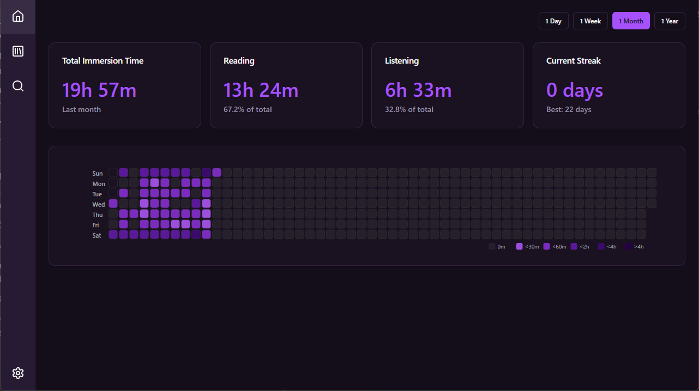
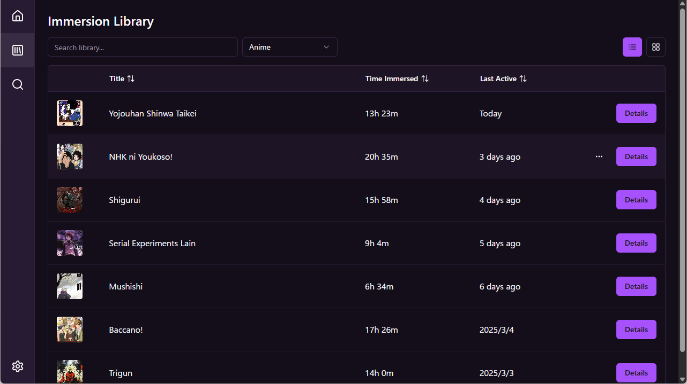
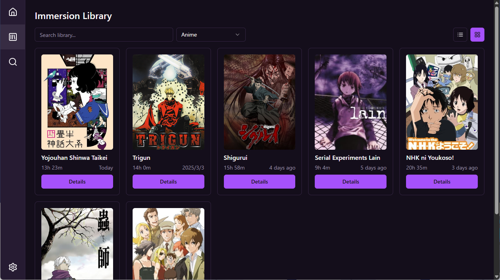
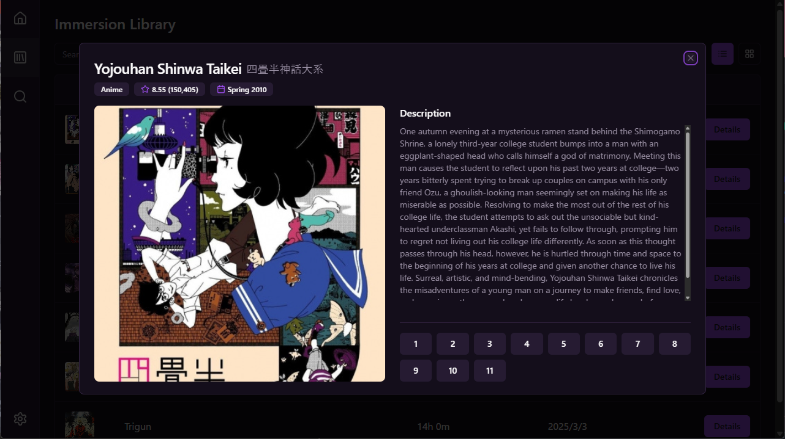
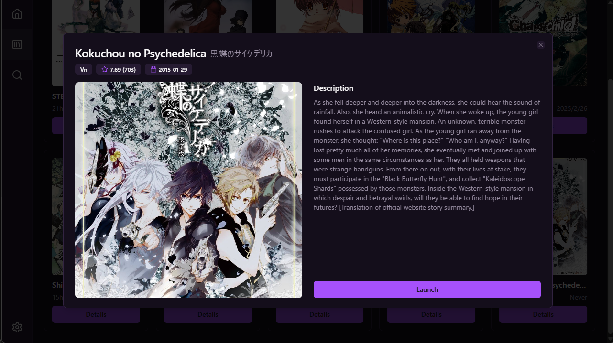

# Murasaki 🌸
Murasaki is a multimedia library designed to help you track and enhance your Japanese immersion journey. It seamlessly manages your anime and visual novel library while logging your immersion time, providing insightful statistics to monitor your progress. 

Writen in blazing-fast Svelte and Rust, Murasaki aims to be a lightweight option for serious learners. This application is built on the Tauri framework, combining web technologies with native performance for a responsive and efficient experience. 

## Key Features
- Unified library management for anime and visual novels
- Automatic time tracking to log your immersion activities
- Activity heatmap to monitor consistency and streaks
- Seamless media launching that integrates your preferred players

## Roadmap
Here are the improvements that I would like to make to Murasaki, presented in order of priority:
- Graph that measures cummulative immersion over time on the dashboard
- Per-content statistics displays in the details section of each piece of media
- Browser extension to track immersion on YouTube or ッツ Ebook Reader

## Installation
[TODO: Include releases]

### Requirements
- **Windows**: Windows 10 or later
- **macOS (Untested)**: macOS 10.15 (Catalina) or later

### Building from source
If you'd like to build Murasaki from source, follow these steps:

#### Prerequisites
Follow your operating system's guidelines on the [Tauri Prerequisites Guide](https://v2.tauri.app/start/prerequisites/). 

This should have you install Rust, Node.js, and any platform specific dependencies.

#### Build Steps
Clone the repository:
```bash
git clone https://github.com/muheii/murasaki.git
cd murasaki
```

Install frontend dependencies:
```bash
npm install
```

To run in development mode:
```bash
cargo tauri dev
```

To build for production:
```bash
cargo tauri build
```

## Gallery
<div align="center">
  <div style="display: flex; align-items: center; margin-bottom: 40px;">
    
    <div>
      <h3>Immersion Analytics Dashboard</h3>
      <p>Track your language learning progress with an activity heatmap and statistics. The dashboard provides a visual breakdown of your reading and listening time, allowing you to analyze your immersion habits.</p>
    </div>
  </div>

  <div style="display: flex; align-items: center; margin-bottom: 40px;">
    <div style="margin-right: 20px;">
      <h3>Flexible Library Management</h3>
      <p>View your entire collection in either a compact list view or a visual grid display. Sort by title, time immersed, or most recently active to quickly find what you're looking for. The table view provides detailed stats at a glance for efficient management.</p>
    </div>
    
  </div>

  <div style="display: flex; align-items: center; margin-bottom: 40px;">
    
    <div>
      <h3>Visual Content Browser</h3>
      <p>Browse your collection in a visually appealing grid layout that showcases cover art. This makes it easy to recognize content at a glance while still displaying important statistics like immersion time and last active date.</p>
    </div>
  </div>

  <div style="display: flex; align-items: center; margin-bottom: 40px;">
    <div style="margin-right: 20px;">
      <h3>Media Details & Episode Tracking</h3>
      <p>View comprehensive information about each title including ratings, descriptions, and episode counts. For anime, there is an intuitive episode selection interface that integrates with your preferred media player.</p>
    </div>
    
  </div>

  <div style="display: flex; align-items: center; margin-bottom: 40px;">
    
    <div>
      <h3>Visual Novel Integration</h3>
      <p>Launch visual novels directly from Murasaki with automatic time tracking. Toggle settings to automatically open and close texthooking tools and pages, eliminating some of that hassle.</p>
    </div>
  </div>
</div>

## About 

Murasaki was born from my personal journey learning Japanese through immersion. After getting annoyed with constant local file management, I decided to build something that could help me (and hopefully others) track their progress more effectively.

If you find this tool helpful in your language learning journey, I'd love to hear about it! Feel free to reach out to me with any feedback that you might have.

---

<div align="center">
  <p>Built with ❤️ by <a href="https://github.com/muheii">muhei</a></p>
  <p>
    
    
    
  </p>
</div>